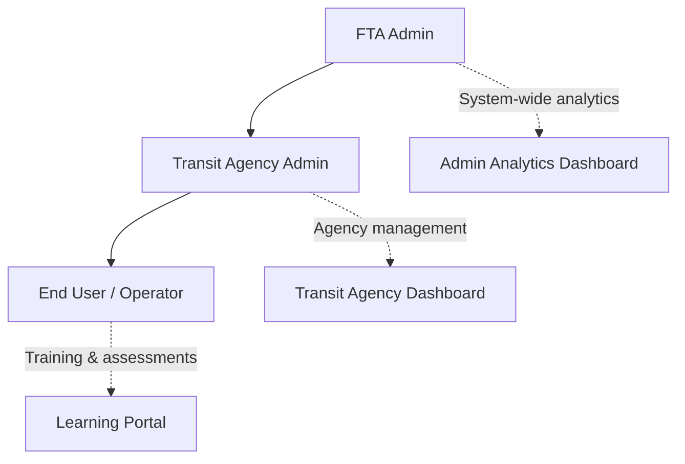
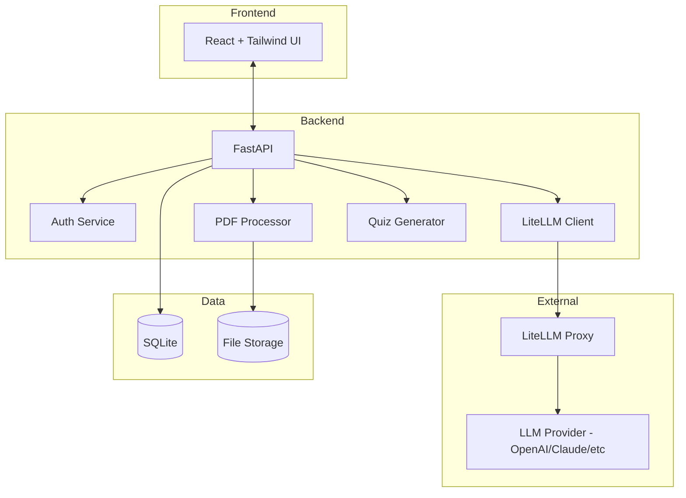
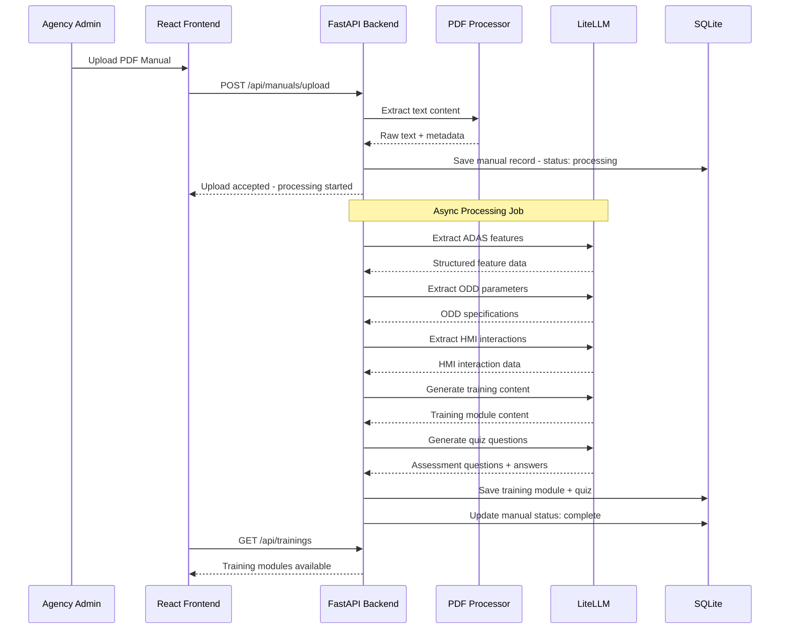
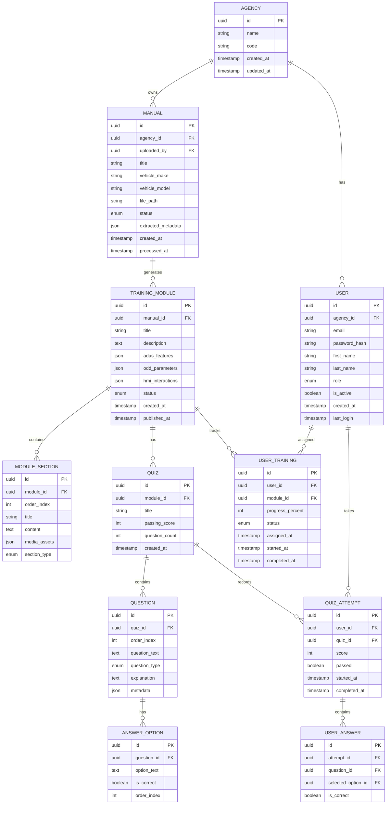
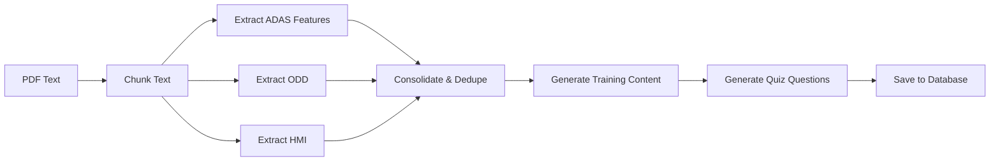
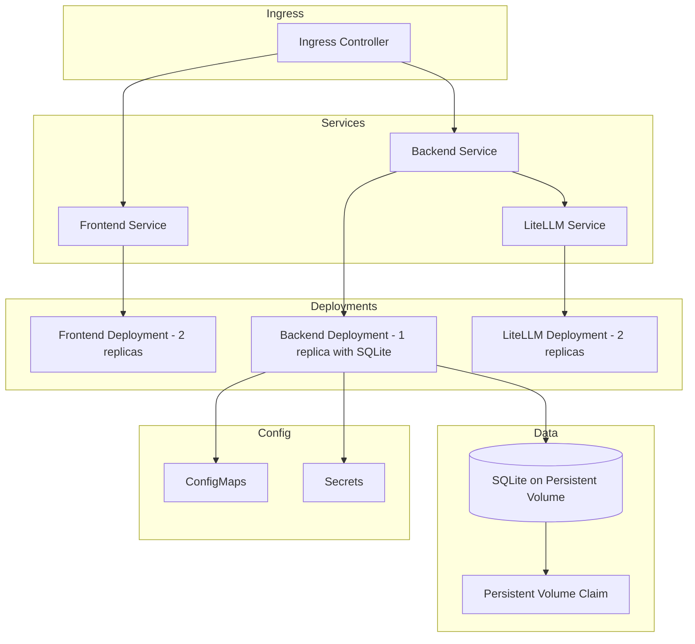

# FTA ADAS Training Web Application - Architecture Plan

## Executive Summary

This document outlines the architecture and implementation plan for a web-based application that enables FTA (Federal Transit Administration) personnel to upload vehicle ADAS (Advanced Driver Assistance Systems) user manuals in PDF format. The application leverages LLM technology via LiteLLM to extract key information including images and text and automatically generate, pre-test questions, training slides and associated questions, and post-test training assessments for transit operators.

---

## 1. Project Overview

### 1.1 Purpose
Enable transit agencies to:
- Upload vehicle ADAS user manuals (PDF)
- Automatically extract ADAS functionality, Operational Design Domain (ODD), and Human-Machine Interface (HMI) interactions using AI
- Generate training modules, questions about material being trained, and both pre-test and post-test assessments to validate operator/driver knowledge

### 1.2 Key Features
- **PDF Upload & Processing**: Accept vehicle manuals and extract structured content
- **AI-Powered Content Extraction**: Identify ADAS features, ADAS functions, ODD parameters, and HMI interactions. The identification will require knowledge of content that is presented in text and images. ADAS refers to advanced driver assistance systems. ADAS features include lane keeping assist (LKA), lane centering assist (LCA), adaptive cruise control (ACC), among others.  ODD refers to the operational design domain of the ADAS feature. HMI refers to the human-machine interface of the ADAS feature.
- **Training Module Generation**: Create interactive learning content from extracted data. The interactive training program should have separate training modules for each different ADAS feature. For each feature, the content should be arranged in separate slides as if those slides were being presented in PowerPoint, starting first with the slides on functionality, then with the slides on the ODD, and finally with the slides on the HMI.  The slides can contain both images and text. In general, there should be no more than 200 words on a slide.  12 point font should be used, arial. There should be both (1) training slides and (2) question and multiple choice answer slides after each training slide. Multiple training slides may be needed to adequately describe for each ADAS feature the functionality, ODD, and HMI
- - (1) Training slides.  For a given ADAS feature, discuss first the functionality, then the ODD, and finally the HMI and the interaction of the driver with the HMI that is needed to realize the different functions that the HMI can perform.  Number each slide in the training and indicate both the ADAS feature which is being tested and whether it is being used to train the ADAS functionality, the ADAS ODD, or the ADAS HMI. So, this would be fine: "8 ACC - ODD", where "8" is the slide number, ACC is the ADAS feature, and ODD is the ADAS characteristic that is being trained.
- - (2) Question and multiple choice answer slides after each training slide. After each training slide you will want to insert a question and answer slide. The questions will assess a driver's understanding of what was presented on the previous training slide.  The question for an HMI training slide might simply be, "Which of the four statements below is true about what button you should press to set the speed on ACC." More generally each question should identify the ADAS feature which is being referred to in teh question. Each question should have four answers. Half of the question and answer slides will have "Other" as the fourth answer.  The other three answers should be related to the concept being trained on the previous slide and probe possible misunderstandings the driver may have of the concept that was trained on the previous slide. Those three answers will each be incorrect, but make it likely that drivers who misunderstand the concept will choose an incorrect answer. The other half of the question and answer slides should have four answers, one of which is correct and the other three incorrect.  Again the incorrect answers should be ones that test whether the driver has really understood the concept being trained on the last slide. Use a pseudorandom ordering of the slides with "other" as the correct answer and one of the answers to a question as the correct answer.  For every 8 training slides with question and answer slides, half of the question and answer should have "other" and half should have one of the four answers as correct. Use the same numbering scheme for the question and answer slides as was used for teh training slides, only add "question at the end." For example, if the training slide were numbered "1 ACC ODD" the question and answer slide would be numbered "2 ACC ODD Question".  The number increases on the question and answer slide from "1" to "2" because the question and answer slide follows immediately after the training slide.
- **Pre-Test and Post-Test Assessment**: There will be a pre-test and post-test.  All of the question and answer slides that were included in training will be on both the pre-test and the post-test.   Randomize the order of question and answer slides presented in the trainig for the pre-test and for the post-test. Also, for each slide randomize the order of the answers, including "other". Group the pre-test questions into one file, the post-test questions into another file.  Make sure the number on the slides in the pre-test and post-test is the same as the numbering on the 
- **Progress Tracking**: Monitor user answers to the questions on the pre-test, training slides, and post-test. The score should be 1 if correct, 0 if incorrect.  For each driver, record the number of the pre-test, training, and post-test slides in the second column, third column, and so on. Group the columns into pre-test questions, training questions, and post-test questions.  The numbering of the slides should be in order, starting at 1 and the label placed as a column header in row 1. Put each driver in a separate row.  The driver will then have a 1 in a row and column entry if the question was answered correctly, a 0 if incorrect, and an "NA" if there was no answer.
- **Multi-Tenant Architecture**: Support multiple transit agencies with role-based access

---

## 2. User Roles & Permissions

### 2.1 Role Hierarchy



### 2.2 Role Definitions

| Role | Permissions |
|------|-------------|
| **FTA Admin** | View all agencies, system analytics, manage global settings, user management across all agencies |
| **Transit Agency Admin** | Upload PDFs, manage training modules for their agency, view agency-specific reports, manage agency users |
| **End User / Operator** | Access assigned trainings, complete assessments, view certificates, track personal progress |

---

## 3. Technical Architecture

### 3.1 Technology Stack

| Layer | Technology |
|-------|------------|
| **Frontend** | React 18+ with TypeScript, Tailwind CSS |
| **Backend API** | Python FastAPI |
| **Database** | SQLite 3 (with aiosqlite for async support) |
| **AI/LLM** | LiteLLM Proxy (supports multiple LLM backends) |
| **PDF Processing** | PyMuPDF (fitz), pdfplumber |
| **Authentication** | JWT with FastAPI-Users or custom implementation |
| **Containerization** | Docker, Docker Compose (local dev) |
| **Orchestration** | Kubernetes with Helm (production) |
| **File Storage** | Local filesystem (dev), S3-compatible storage (prod) |

### 3.2 System Architecture Diagram



### 3.3 Data Flow - PDF to Training Module



---

## 4. Database Schema

### 4.1 Entity Relationship Diagram



---

## 5. API Endpoints

### 5.1 Authentication

| Method | Endpoint | Description |
|--------|----------|-------------|
| POST | `/api/auth/login` | User login, returns JWT |
| POST | `/api/auth/logout` | Invalidate token |
| POST | `/api/auth/refresh` | Refresh access token |
| GET | `/api/auth/me` | Get current user profile |

### 5.2 Agency Management (FTA Admin)

| Method | Endpoint | Description |
|--------|----------|-------------|
| GET | `/api/agencies` | List all agencies |
| POST | `/api/agencies` | Create new agency |
| GET | `/api/agencies/{id}` | Get agency details |
| PUT | `/api/agencies/{id}` | Update agency |
| DELETE | `/api/agencies/{id}` | Deactivate agency |

### 5.3 User Management

| Method | Endpoint | Description |
|--------|----------|-------------|
| GET | `/api/users` | List users (scoped by role) |
| POST | `/api/users` | Create new user |
| GET | `/api/users/{id}` | Get user details |
| PUT | `/api/users/{id}` | Update user |
| DELETE | `/api/users/{id}` | Deactivate user |

### 5.4 Manual Management

| Method | Endpoint | Description |
|--------|----------|-------------|
| GET | `/api/manuals` | List manuals for agency |
| POST | `/api/manuals/upload` | Upload new PDF manual |
| GET | `/api/manuals/{id}` | Get manual details + status |
| GET | `/api/manuals/{id}/content` | Get extracted content |
| DELETE | `/api/manuals/{id}` | Delete manual |
| POST | `/api/manuals/{id}/reprocess` | Reprocess with LLM |

### 5.5 Training Modules

| Method | Endpoint | Description |
|--------|----------|-------------|
| GET | `/api/trainings` | List training modules |
| GET | `/api/trainings/{id}` | Get training details |
| PUT | `/api/trainings/{id}` | Update training (edit content) |
| POST | `/api/trainings/{id}/publish` | Publish training |
| POST | `/api/trainings/{id}/assign` | Assign to users |
| GET | `/api/trainings/{id}/sections` | Get module sections |

### 5.6 Quizzes & Assessments

| Method | Endpoint | Description |
|--------|----------|-------------|
| GET | `/api/quizzes/{id}` | Get quiz with questions |
| POST | `/api/quizzes/{id}/start` | Start quiz attempt |
| POST | `/api/quizzes/{id}/submit` | Submit quiz answers |
| GET | `/api/quizzes/{id}/results` | Get quiz results |

### 5.7 User Learning Portal

| Method | Endpoint | Description |
|--------|----------|-------------|
| GET | `/api/my/trainings` | Get assigned trainings |
| GET | `/api/my/trainings/{id}/progress` | Get training progress |
| POST | `/api/my/trainings/{id}/progress` | Update progress |
| GET | `/api/my/certificates` | Get earned certificates |
| GET | `/api/my/stats` | Get learning statistics |

### 5.8 Analytics (Admin)

| Method | Endpoint | Description |
|--------|----------|-------------|
| GET | `/api/analytics/overview` | System-wide stats (FTA Admin) |
| GET | `/api/analytics/agency/{id}` | Agency-specific analytics |
| GET | `/api/analytics/trainings/{id}` | Training engagement metrics |
| GET | `/api/analytics/export` | Export reports as CSV |

---

## 6. LLM Integration Strategy

### 6.1 LiteLLM Configuration

```python
# Example LiteLLM client configuration
from litellm import completion

# The proxy URL will be configured via environment variable
LITELLM_PROXY_URL = os.getenv("LITELLM_PROXY_URL", "http://localhost:4000")

async def call_llm(prompt: str, system_prompt: str) -> str:
    response = await completion(
        model="gpt-4",  # Model routing handled by LiteLLM proxy
        messages=[
            {"role": "system", "content": system_prompt},
            {"role": "user", "content": prompt}
        ],
        api_base=LITELLM_PROXY_URL
    )
    return response.choices[0].message.content
```

### 6.2 Prompt Engineering Strategy

#### 6.2.1 ADAS Feature Extraction Prompt
```
System: You are an expert in vehicle ADAS systems. Extract all ADAS features from the provided vehicle manual text.

For each feature, provide:
- Feature name
- Description
- Activation conditions
- Deactivation conditions
- Warning indicators
- Limitations

Output as structured JSON.
```

#### 6.2.2 ODD Parameter Extraction Prompt
```
System: You are an expert in Operational Design Domain analysis for ADAS systems.

Extract the following ODD parameters:
- Speed ranges (min/max operational speeds)
- Weather conditions (rain, snow, fog limitations)
- Road types (highway, urban, rural)
- Lighting conditions (day, night, tunnel)
- Geographic limitations
- Infrastructure requirements (lane markings, signs)

Output as structured JSON.
```

#### 6.2.3 HMI Interaction Extraction Prompt
```
System: You are an expert in Human-Machine Interface design for vehicles.

Extract all operator interactions including:
- Dashboard indicators and their meanings
- Audio alerts and their triggers
- Haptic feedback mechanisms
- Override procedures
- Emergency controls
- Settings and customization options

Output as structured JSON.
```

#### 6.2.4 Quiz Generation Prompt
```
System: You are an expert instructional designer creating assessment questions for transit vehicle operators.

Based on the ADAS training content provided, generate multiple-choice questions that test:
- Understanding of feature functionality
- Recognition of warning indicators
- Knowledge of operational limitations
- Proper response procedures
- Safety protocols

For each question provide:
- Question text
- 4 answer options
- Correct answer
- Explanation for the correct answer
- Difficulty level (easy, medium, hard)

Generate questions that are practical and scenario-based when possible.
```

### 6.3 Processing Pipeline



---

## 7. Frontend Component Structure

### 7.1 Application Routes

```
/login                          - Unified Login Screen
/
├── /admin                      - FTA Admin Dashboard
│   ├── /analytics              - System Analytics
│   ├── /agencies               - Agency Management
│   ├── /users                  - User Management
│   └── /settings               - System Settings
│
├── /agency                     - Transit Agency Dashboard
│   ├── /dashboard              - Agency Overview
│   ├── /manuals                - Manual Management
│   │   └── /upload             - Upload New Manual
│   ├── /trainings              - Training Library
│   │   ├── /{id}               - Training Detail
│   │   └── /{id}/edit          - Edit Training
│   ├── /reports                - Agency Reports
│   └── /users                  - Agency User Management
│
└── /learn                      - End User Learning Portal
    ├── /dashboard              - User Dashboard
    ├── /trainings              - Assigned Trainings
    │   └── /{id}               - Interactive Training Module
    ├── /assessments            - Assessments
    │   └── /{id}               - Post-Test Quiz
    ├── /certificates           - Earned Certificates
    └── /profile                - User Profile
```

### 7.2 Key React Components

```
src/
├── components/
│   ├── common/
│   │   ├── Button.tsx
│   │   ├── Card.tsx
│   │   ├── Modal.tsx
│   │   ├── Table.tsx
│   │   ├── ProgressBar.tsx
│   │   └── FileUpload.tsx
│   ├── layout/
│   │   ├── Sidebar.tsx
│   │   ├── Header.tsx
│   │   └── Footer.tsx
│   ├── auth/
│   │   ├── LoginForm.tsx
│   │   └── ProtectedRoute.tsx
│   ├── admin/
│   │   ├── StatsCard.tsx
│   │   ├── ActivityChart.tsx
│   │   └── UserManagementTable.tsx
│   ├── agency/
│   │   ├── ManualUploader.tsx
│   │   ├── TrainingTable.tsx
│   │   └── ProcessingStatus.tsx
│   ├── training/
│   │   ├── ModuleViewer.tsx
│   │   ├── InteractiveDiagram.tsx
│   │   └── NavigationControls.tsx
│   └── quiz/
│       ├── QuestionCard.tsx
│       ├── AnswerOption.tsx
│       ├── ProgressTracker.tsx
│       └── ResultsSummary.tsx
├── pages/
│   ├── LoginPage.tsx
│   ├── admin/
│   ├── agency/
│   └── learn/
├── hooks/
│   ├── useAuth.ts
│   ├── useTraining.ts
│   └── useQuiz.ts
├── services/
│   ├── api.ts
│   ├── auth.ts
│   └── storage.ts
└── store/
    ├── authSlice.ts
    ├── trainingSlice.ts
    └── quizSlice.ts
```

---

## 8. Deployment Architecture

### 8.1 Local Development (Docker Compose)

```yaml
# docker-compose.yml structure
services:
  frontend:
    build: ./frontend
    ports:
      - "3000:3000"
    
  backend:
    build: ./backend
    ports:
      - "8000:8000"
    volumes:
      - sqlite_data:/app/data  # Persist SQLite database
    depends_on:
      - litellm
    
  # Note: SQLite runs embedded in the backend - no separate db service needed
    
  litellm:
    image: ghcr.io/berriai/litellm:main-latest
    ports:
      - "4000:4000"

volumes:
  sqlite_data:
```

### 8.2 Kubernetes Production Architecture



> **Note on SQLite in Production**: SQLite is suitable for single-instance deployments with moderate traffic. For high-availability or multi-replica backend deployments, consider migrating to PostgreSQL or using a distributed SQLite solution like LiteFS.

### 8.3 Helm Chart Structure

```
helm/
├── Chart.yaml
├── values.yaml
├── values-dev.yaml
├── values-staging.yaml
├── values-prod.yaml
└── templates/
    ├── frontend-deployment.yaml
    ├── frontend-service.yaml
    ├── backend-deployment.yaml
    ├── backend-service.yaml
    ├── litellm-deployment.yaml
    ├── litellm-service.yaml
    ├── ingress.yaml
    ├── configmap.yaml
    ├── secrets.yaml
    └── pvc.yaml  # For SQLite data persistence
```

---

## 9. Implementation Phases

### Phase 1: Foundation
- [ ] Set up project structure (monorepo with backend/frontend/helm)
- [ ] Configure Docker Compose for local development
- [ ] Implement SQLite database schema with migrations (Alembic)
- [ ] Create FastAPI project structure with core middleware
- [ ] Implement JWT authentication system
- [ ] Create React project with routing and Tailwind setup
- [ ] Build login page and authentication flow

### Phase 2: Core Backend Services
- [ ] Implement user management API endpoints
- [ ] Implement agency management API endpoints
- [ ] Build PDF upload and storage service
- [ ] Implement PDF text extraction service
- [ ] Create LiteLLM integration service
- [ ] Build ADAS feature extraction pipeline
- [ ] Build ODD parameter extraction pipeline
- [ ] Build HMI interaction extraction pipeline
- [ ] Implement async job processing for PDF analysis

### Phase 3: Training Module Generation
- [ ] Build training content generation service
- [ ] Implement quiz question generation service
- [ ] Create training module CRUD endpoints
- [ ] Implement module section management
- [ ] Build quiz and question management endpoints

### Phase 4: Transit Agency Dashboard
- [ ] Build agency dashboard page
- [ ] Implement manual upload interface with drag-and-drop
- [ ] Create processing status tracking UI
- [ ] Build training library view and management
- [ ] Implement training editing capabilities
- [ ] Create user assignment functionality
- [ ] Build agency reports and analytics views

### Phase 5: End User Learning Portal
- [ ] Build user dashboard with progress overview
- [ ] Create assigned trainings list view
- [ ] Implement interactive training module viewer
- [ ] Build post-test assessment quiz interface
- [ ] Implement progress tracking and saving
- [ ] Create certificate generation and display
- [ ] Build user profile management

### Phase 6: FTA Admin Dashboard
- [ ] Build system-wide analytics dashboard
- [ ] Implement agency management interface
- [ ] Create global user management
- [ ] Build system health monitoring
- [ ] Implement report export functionality

### Phase 7: Production Readiness
- [ ] Create Helm charts for Kubernetes deployment
- [ ] Implement comprehensive error handling
- [ ] Add logging and monitoring
- [ ] Write unit and integration tests
- [ ] Perform security audit
- [ ] Create deployment documentation
- [ ] Load testing and performance optimization

---

## 10. Project Directory Structure

```
ai-fta-training/
├── README.md
├── docker-compose.yml
├── .gitignore
├── .env.example
│
├── backend/
│   ├── Dockerfile
│   ├── requirements.txt
│   ├── alembic.ini
│   ├── alembic/
│   │   └── versions/
│   ├── app/
│   │   ├── __init__.py
│   │   ├── main.py
│   │   ├── config.py
│   │   ├── database.py
│   │   ├── models/
│   │   │   ├── __init__.py
│   │   │   ├── user.py
│   │   │   ├── agency.py
│   │   │   ├── manual.py
│   │   │   ├── training.py
│   │   │   └── quiz.py
│   │   ├── schemas/
│   │   │   ├── __init__.py
│   │   │   ├── user.py
│   │   │   ├── agency.py
│   │   │   ├── manual.py
│   │   │   ├── training.py
│   │   │   └── quiz.py
│   │   ├── api/
│   │   │   ├── __init__.py
│   │   │   ├── deps.py
│   │   │   └── v1/
│   │   │       ├── __init__.py
│   │   │       ├── auth.py
│   │   │       ├── users.py
│   │   │       ├── agencies.py
│   │   │       ├── manuals.py
│   │   │       ├── trainings.py
│   │   │       ├── quizzes.py
│   │   │       └── analytics.py
│   │   ├── services/
│   │   │   ├── __init__.py
│   │   │   ├── auth.py
│   │   │   ├── pdf_processor.py
│   │   │   ├── llm_service.py
│   │   │   ├── training_generator.py
│   │   │   └── quiz_generator.py
│   │   └── core/
│   │       ├── __init__.py
│   │       ├── security.py
│   │       └── exceptions.py
│   └── tests/
│       ├── __init__.py
│       ├── conftest.py
│       └── api/
│
├── frontend/
│   ├── Dockerfile
│   ├── package.json
│   ├── tsconfig.json
│   ├── tailwind.config.js
│   ├── vite.config.ts
│   ├── index.html
│   ├── public/
│   └── src/
│       ├── main.tsx
│       ├── App.tsx
│       ├── index.css
│       ├── components/
│       ├── pages/
│       ├── hooks/
│       ├── services/
│       ├── store/
│       └── types/
│
├── helm/
│   ├── Chart.yaml
│   ├── values.yaml
│   └── templates/
│
├── plans/
│   └── fta-adas-training-app-plan.md
│
└── UI_Mockup/
    └── (existing mockup files)
```

---

## 11. Environment Variables

```bash
# Backend
DATABASE_URL=sqlite+aiosqlite:///./data/fta_adas.db
SECRET_KEY=your-secret-key-here
ALGORITHM=HS256
ACCESS_TOKEN_EXPIRE_MINUTES=30
REFRESH_TOKEN_EXPIRE_DAYS=7

# LiteLLM
LITELLM_PROXY_URL=http://localhost:4000
LITELLM_API_KEY=your-litellm-key

# File Storage
UPLOAD_DIR=/app/uploads
MAX_UPLOAD_SIZE=52428800  # 50MB

# Frontend
VITE_API_URL=http://localhost:8000/api/v1
```

### 11.1 SQLite Configuration Notes

SQLite requires different connection handling than PostgreSQL:

```python
# Example SQLAlchemy async engine configuration for SQLite
from sqlalchemy.ext.asyncio import create_async_engine, AsyncSession
from sqlalchemy.orm import sessionmaker

DATABASE_URL = "sqlite+aiosqlite:///./data/fta_adas.db"

engine = create_async_engine(
    DATABASE_URL,
    connect_args={"check_same_thread": False},  # Required for SQLite
    echo=True  # Set to False in production
)

AsyncSessionLocal = sessionmaker(
    engine, class_=AsyncSession, expire_on_commit=False
)
```

---

## 12. Security Considerations

1. **Authentication**: JWT tokens with refresh mechanism
2. **Authorization**: Role-based access control (RBAC) at API level
3. **Data Isolation**: Multi-tenant data separation by agency
4. **Input Validation**: Pydantic schemas for all API inputs
5. **File Upload Security**: Validate PDF MIME types, scan for malware
6. **API Rate Limiting**: Prevent abuse of LLM endpoints
7. **HTTPS**: Enforce TLS in production
8. **Secrets Management**: Use Kubernetes secrets in production
9. **Audit Logging**: Track sensitive operations

---

## 13. Success Metrics

| Metric | Target |
|--------|--------|
| PDF Processing Time | < 5 minutes for 100-page manual |
| Quiz Generation Accuracy | > 90% relevant questions |
| System Uptime | 99.5% |
| API Response Time | < 500ms for standard endpoints |
| User Training Completion Rate | > 80% |
| Assessment Pass Rate | > 75% |

---

## Next Steps

1. Review and approve this architecture plan
2. Switch to Code mode to begin implementation starting with Phase 1
3. Set up the project structure and development environment
4. Begin iterative development following the phased approach
